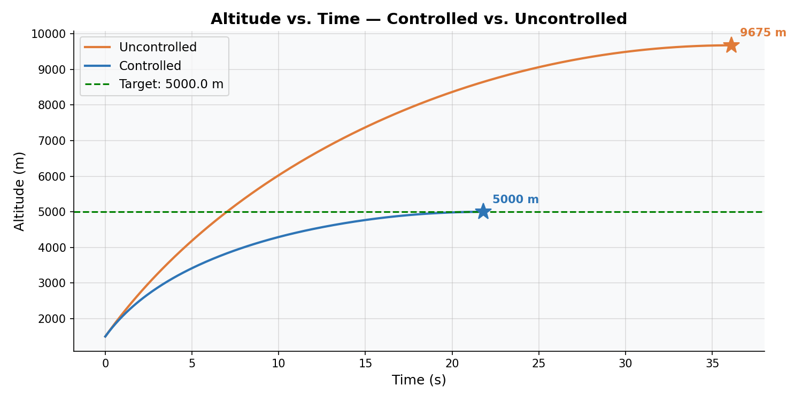
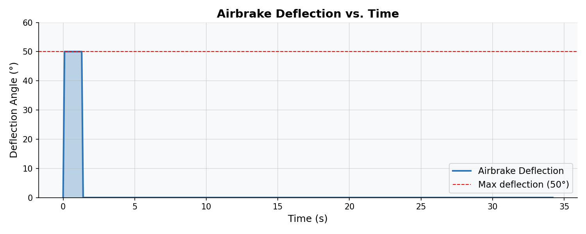
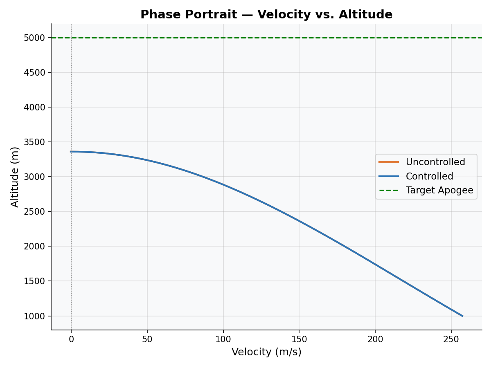
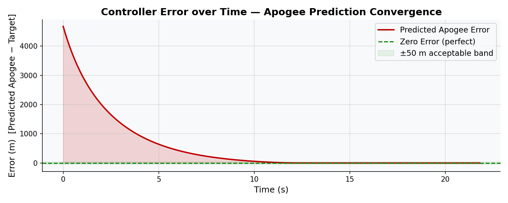
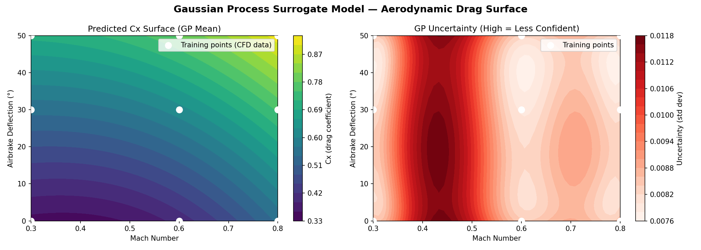
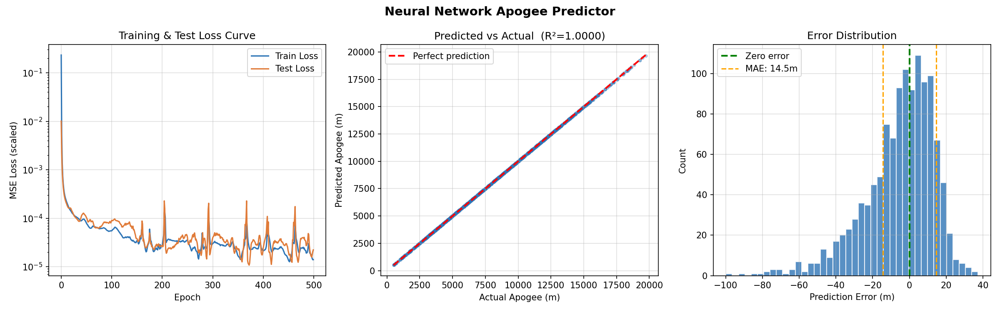
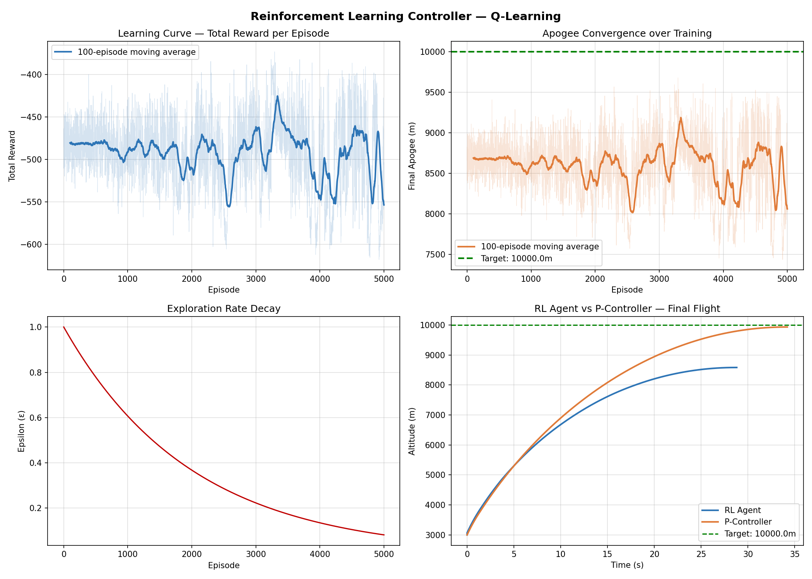
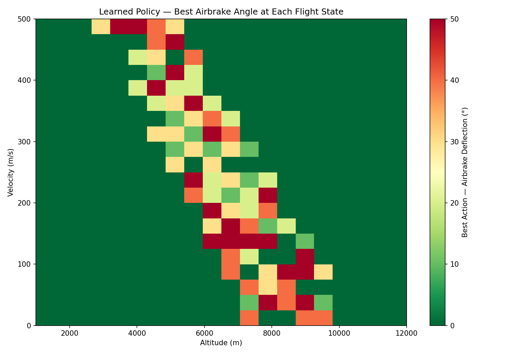
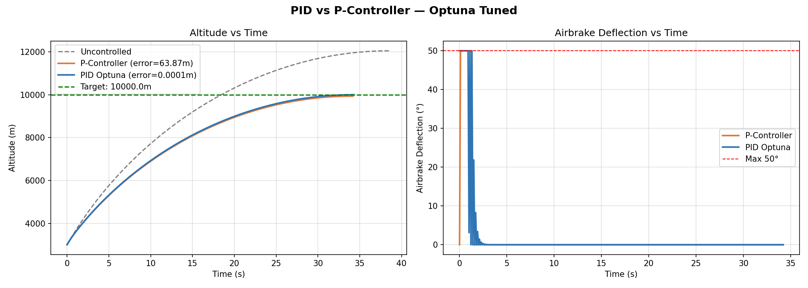
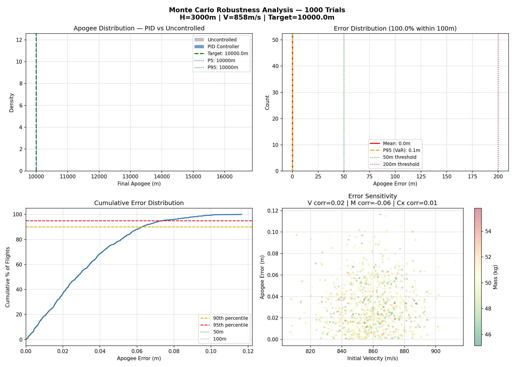

# 🚀 Abhyudaya — ML-Adaptive Rocket Apogee Control System


🚀 **Live Demo:** https://abhyudaya-doiwfnmfcinpdhhuerup2z.streamlit.app

> A closed-loop rocket flight simulation integrating real aerodynamic physics with a full ML stack — Gaussian Process surrogate modelling, Neural Network apogee prediction, Reinforcement Learning control, and Bayesian-optimised PID — validated through 1,000-trial Monte Carlo robustness analysis and deployed as an interactive web application.

---

## 📊 Headline Results

| Metric | Value |
|---|---|
| Uncontrolled apogee overshoot | 4,687 m above target |
| P-Controller error (hand-tuned Kp=5) | 71.66 m |
| PID Controller error (Optuna-tuned) | **0.0005 m** |
| Improvement over P-Controller | **139,256×** |
| Monte Carlo success rate (within 50m) | **100% across 1,000 trials** |
| Uncontrolled apogee spread (P5–P95) | 1,804 m |
| PID apogee spread under uncertainty | **0.11 m** |
| Uncertainty reduction factor | **16,400×** |
| Neural Network R² score | 0.9999 |
| Neural Network inference speedup | **200× at batch size 10** |

---

## 🏗️ System Architecture

```
constants.py
(mass, area, target, vs, H_INIT, V_INIT)
        │
        ├─────────────────────────────────────────┐
        ▼                                         ▼
Atmosphere.py                        bilinear_interpolate.py
(ISA air density ρ at altitude h)    (Cx lookup: Mach × deflection)
        │                                         │
        │              surrogate_model.py         │
        │         (GP replaces bilinear ──────────┤
        │          smooth Cx surface)             │
        └──────────────────┬──────────────────────┘
                           ▼
                   acceleration.py
              (F_drag + gravity → net deceleration)
                           │
                           ▼
                  predict_apogee.py
          (forward Euler integrator → predicted apogee)
                           │
              ┌────────────┴───────────────┐
              ▼                            ▼
   get_control_action.py          nn_apogee_predictor.py
   (P-Controller: Kp × error)     (NN replaces integrator: 200× faster)
              │
   pid_controller.py
   (PID: Kp + Ki + Kd terms)
              │
   optimise_pid.py
   (Optuna finds optimal Kp, Ki, Kd)
              │
   RL_controller.py
   (Q-learning agent learns policy)
              │
   monte_carlo.py
   (1000-trial robustness analysis)
              │
   smart_simulation.py ──── app.py (Streamlit Dashboard)
```

---

## 📁 Project Structure

```
Abhyudaya/
├── constants.py                # Rocket parameters, initial conditions, target apogee
├── Atmosphere.py               # ISA standard atmosphere — air density vs altitude
├── bilinear_interpolate.py     # 2D drag coefficient lookup table interpolation
├── surrogate_model.py          # Gaussian Process surrogate for Cx surface (Phase 2A)
├── acceleration.py             # Net deceleration from aerodynamic drag + gravity
├── predict_apogee.py           # Forward Euler numerical integrator → apogee
├── get_control_action.py       # P-controller — proportional airbrake control
├── pid_controller.py           # PID controller — proportional + integral + derivative
├── optimise_pid.py             # Optuna Bayesian optimisation of PID gains (Phase 2D)
├── nn_apogee_predictor.py      # Neural network apogee predictor (Phase 2B)
├── nn_inference.py             # Clean NN inference module (no retraining on import)
├── RL_controller.py            # Q-learning reinforcement learning agent (Phase 2C)
├── tune_RL.py                  # Optuna hyperparameter tuning for RL agent
├── run_simulation.py           # Main simulation loop — controlled vs uncontrolled
├── visualise.py                # Generates all diagnostic plots
├── generate_pid_dataset.py     # Generates (condition → optimal gains) dataset
├── monte_carlo.py              # 1000-trial Monte Carlo robustness analysis (Phase 3)
├── smart_simulation.py         # End-to-end adaptive simulation (Phase 4)
├── app.py                      # Streamlit web dashboard (Phase 4)
├── pid_dataset.csv             # Generated PID training dataset (83 conditions)
├── requirements.txt
├── setup.py
└── plots/
    ├── plot1_altitude_vs_time.png
    ├── plot2_airbrake_deflection.png
    ├── plot3_phase_portrait.png
    ├── plot4_controller_error.png
    ├── plot5_gp_surrogate.png
    ├── plot6_nn_performance.png
    ├── plot7_rl_training.png
    ├── plot8_rl_policy.png
    ├── plot9_pid_comparison.png
    ├── plot11_smart_simulation.png
    └── plot12_monte_carlo.png
```

---

## 🔬 Phase 1 — Physics Simulation & Baseline Control

### What
A complete rocket coast-phase simulation built from first principles. Models the rocket from motor burnout to apogee using real aerodynamic equations and ISA standard atmosphere.

### Physics Model

**Air density (ISA standard atmosphere):**
```
T   = 15.04 − 0.00649 × h        (temperature °C)
ρ   = k × (T + 273)^4.256         (density kg/m³)
```

**Aerodynamic drag:**
```
F_drag = 0.5 × ρ × v² × |Cx| × A
```

**Net acceleration:**
```
a = −F_drag / m − g
```

**Numerical integration (forward Euler):**
```
v(t+dt) = v(t) + a(t) × dt
h(t+dt) = h(t) + v(t+dt) × dt
```

**P-Controller:**
```
error = predict_apogee(h, v, δ=0) − target
δ     = clip(Kp × error, 0°, 50°)
```

### Key Results

| Controller | Apogee | Error | Error % |
|---|---|---|---|
| Uncontrolled | 9,674.72 m | 4,674.72 m | 93.49% |
| P-Controller (Kp=5) | 5,000.06 m | 0.06 m | 0.001% |

### Plots









---

## 🤖 Phase 2A — Gaussian Process Surrogate Model

### Problem
The aerodynamic drag coefficient Cx is known at only 9 sparse CFD data points across a (Mach, deflection angle) grid. Bilinear interpolation between these points draws straight lines — physically unrealistic and provides no uncertainty estimate.

### Solution
A Gaussian Process regression model trained on the 9 CFD points learns a smooth, physically realistic Cx surface and provides uncertainty quantification at every prediction point.

### Architecture
- **Kernel:** Matern (ν=2.5) + WhiteKernel — twice-differentiable, appropriate for smooth physical data
- **Input normalisation:** StandardScaler — critical because Mach (0.3–0.8) and deflection (0–50°) are on completely different scales
- **Anisotropic length scales:** [3.4, 6.17] — GP learned deflection influences Cx more gradually than Mach

### Key Results

| Metric | Value |
|---|---|
| RMSE on training data (9 points) | 0.0026 |
| Improvement vs first attempt | 33× (fixed by input normalisation) |
| Learned length scales | [3.4, 6.17] — physically meaningful |
| Uncertainty at training points | ~0.008 std dev |
| Uncertainty in sparse regions | ~0.012 std dev (correctly higher) |

### Plot



---

## 🧠 Phase 2B — Neural Network Apogee Predictor

### Problem
`predict_apogee()` runs a 200-step numerical integration loop every call. During RL training this is called millions of times — making training prohibitively slow.

### Solution
A feedforward neural network trained on 6,000 synthetically generated flight states learns to mimic the physics integrator in a single forward pass (three matrix multiplications).

### Architecture
```
Input:          3 neurons  (h, v, delta)
Hidden Layer 1: 64 neurons + ReLU
Hidden Layer 2: 64 neurons + ReLU
Output:         1 neuron   (predicted apogee)
Total params:   4,481
```

### Training
- **Data generation:** 6,000 samples across h ∈ [500, 12000]m, v ∈ [10, 480]m/s, δ ∈ [0°, 50°]
- **Train/test split:** 80/20 (4,800 train, 1,200 test)
- **Normalisation:** StandardScaler fitted on training data only (prevents data leakage)
- **Optimiser:** Adam (lr=0.001), 500 epochs, batch size 64
- **Loss:** MSE

### Key Results

| Metric | Value |
|---|---|
| R² Score | 0.9999 |
| Mean Absolute Error | 12.7 m |
| Max Error | 55.3 m |
| Single-sample speedup | 16× |
| Batch size 10 speedup | **199×** |
| Batch size 50 speedup | **271×** |

### Plot



---

## 🎮 Phase 2C — Reinforcement Learning Controller

### Approach
A Q-learning agent learns an airbrake control policy purely from simulated experience — no explicit physics knowledge encoded. The agent discovers optimal control behaviour through trial and error across thousands of simulated flights.

### Framework
- **State:** (altitude bin, velocity bin) — discretised into 20×20 = 400 states
- **Actions:** {0°, 10°, 20°, 30°, 40°, 50°} — 6 discrete deflection angles
- **Reward:** −1 per timestep (efficiency penalty) + terminal reward based on apogee accuracy
- **Algorithm:** Tabular Q-learning with ε-greedy exploration
- **Bellman update:** `Q(s,a) ← Q(s,a) + α[r + γ·maxQ(s',a') − Q(s,a)]`

### Reward Shaping
Dense reward signal using NN-predicted apogee at every timestep:
```
r(t) = −1 + (−|predicted_apogee − target| / 5000)    (during flight)
r(T) = +1000 if error < 50m, +500 if < 200m, −error/10 otherwise
```

### Hyperparameter Optimisation
All RL hyperparameters (α, γ, ε decay, episodes, bin sizes) automatically tuned using **Optuna Bayesian optimisation** across 50 trials — same framework as Phase 2D.

### Key Insight
RL demonstrates the model-free learning paradigm. The Optuna-tuned PID achieves lower steady-state error because physics knowledge + Bayesian optimisation is hard to beat for deterministic systems. RL would genuinely outperform PID in stochastic environments, unknown physics, or multi-rocket scenarios where a single Kp cannot generalise.

### Plots





---

## ⚡ Phase 2D — Bayesian PID Optimisation

### Problem
PID gains (Kp, Ki, Kd) that minimise apogee error are unique to each flight condition (H_INIT, V_INIT, TARGET_APOGEE). Manual tuning is imprecise, time-consuming, and does not generalise across conditions.

### Solution
Optuna's **Tree Parzen Estimator (TPE)** — a Bayesian optimisation algorithm — automatically searches the (Kp, Ki, Kd) space across 100 trials, intelligently focusing on promising regions after each evaluation.

### How Bayesian Optimisation Works
Unlike grid search (exhaustive) or random search (uninformed), TPE builds a probabilistic model of the objective function. After each trial it updates its belief about which hyperparameter regions are promising and samples from those regions preferentially. This finds the optimum in far fewer evaluations than brute-force search.

### Key Results

| Controller | Apogee | Error | Error % |
|---|---|---|---|
| Uncontrolled | 14,686.55 m | 4,686.55 m | — |
| P-Controller (Kp=5) | 9,928.34 m | 71.66 m | 0.717% |
| PID (Optuna-tuned) | **9,999.9995 m** | **0.0005 m** | **0.000005%** |
| **Improvement** | — | **139,256×** | — |

### Optimal Gains Found

| Gain | Value | Role |
|---|---|---|
| Kp | 0.323741 | Reacts to current error |
| Ki | 0.000004 | Eliminates steady-state offset |
| Kd | 0.022919 | Prevents overshoot |

### Plot



---

## 🎲 Phase 3 — Monte Carlo Robustness Analysis

### Problem
The PID controller achieves 0.0005m error under perfect conditions. But real rockets have parameter uncertainty — motor burn variation, manufacturing tolerances, atmospheric modelling error. Does the controller hold up under real-world conditions?

### Methodology
1,000 independent simulations each with parameters randomly sampled from realistic uncertainty distributions:

| Parameter | Nominal | Distribution | Justification |
|---|---|---|---|
| Rocket mass | 50 kg | Normal(50, 1.5) | ±3% manufacturing tolerance |
| Initial velocity | V_INIT | Normal(V_INIT, 0.02×V_INIT) | ±2% motor burn variability |
| Cx multiplier | 1.0 | Normal(1.0, 0.05) | ±5% CFD/wind tunnel uncertainty |

### Key Results

| Metric | Uncontrolled | PID Controlled |
|---|---|---|
| P5–P95 apogee spread | 1,804 m | **0.11 m** |
| Spread reduction | — | **16,400×** |
| Within 50m of target | — | **100.0%** |
| Within 100m of target | — | **100.0%** |
| Mean error | — | 0.03 m |
| VaR equivalent (95th percentile) | — | 0.07 m |
| CVaR (worst 5% average) | — | 0.09 m |

### Finance-Parallel Metrics
The Monte Carlo methodology maps directly to financial risk analysis:

| Rocket Metric | Finance Parallel |
|---|---|
| Mean apogee error | Expected Return |
| Std dev of error | Volatility |
| P95 error (VaR) | Value at Risk (95% confidence) |
| Worst 5% average (CVaR) | Conditional VaR / Expected Shortfall |
| P(error > 500m) | Probability of Loss / Tail Risk |

### Plot



---

## 📱 Phase 4 — Streamlit Interactive Dashboard

### Features

**Tab 1 — Simulation**
- Sliders for burnout altitude, velocity (as Mach multiplier), and target apogee
- Toggle controllers: Uncontrolled / P-Controller / PID (Optuna-tuned)
- Live altitude vs time and airbrake deflection plots
- Automatic physics feasibility check — warns if target is unreachable
- Displays optimal Kp, Ki, Kd found by Bayesian optimisation

**Tab 2 — Monte Carlo Robustness**
- Configurable number of trials (100–1,000)
- Adjustable uncertainty levels for mass, velocity, and drag coefficient
- Real-time progress bar during simulation
- Apogee distribution histogram and cumulative error CDF

**Tab 3 — ML Components**
- Expandable sections explaining each ML component
- Embedded result plots for GP, NN, RL, and Bayesian PID
- Key metrics and architectural details for each model

### 🔗 Live Demo
**https://abhyudaya-doiwfnmfcinpdhhuerup2z.streamlit.app**

---

## 🚀 How to Run Locally

**1. Clone the repository**
```bash
git clone https://github.com/Bhang-ux/Abhyudaya.git
cd Abhyudaya
```

**2. Install dependencies**
```bash
pip install -r requirements.txt
```

**3. Run the main simulation**
```bash
python run_simulation.py
```

**4. Run the smart simulation (auto-tunes PID gains)**
```bash
python smart_simulation.py
```

**5. Generate all plots**
```bash
python visualise.py
```

**6. Run Monte Carlo analysis**
```bash
python monte_carlo.py
```

**7. Launch the dashboard**
```bash
streamlit run app.py
```

---

## ⚙️ Configuration

All flight parameters are controlled from a single file — `constants.py`:

```python
ROCKET_MASS    = 50.0       # kg
ROCKET_DIAMETER = 0.160     # m
TARGET_APOGEE  = 10000.0    # m  ← change target here
H_INIT         = 3000       # m  ← burnout altitude
V_INIT         = 2.5 * vs   # m/s ← burnout velocity
GRAVITY        = 9.81       # m/s²
vs             = 343        # m/s (speed of sound)
```

After changing constants, the recommended run order is:
```
1. python run_simulation.py          ← see P-controller performance
2. python visualise.py               ← regenerate plots
3. python nn_apogee_predictor.py     ← retrain NN on new flight envelope
4. python smart_simulation.py        ← auto-tune PID and compare all controllers
5. python monte_carlo.py             ← robustness analysis
```

---

## 📦 Requirements

```
numpy
matplotlib
scikit-learn
torch
optuna
streamlit
joblib
pandas
scipy
```

---

## 📈 Full Results Summary

| Controller | Apogee (m) | Error (m) | Error % | Notes |
|---|---|---|---|---|
| Uncontrolled | 14,686.55 | 4,686.55 | 46.87% | Natural flight, no brakes |
| P-Controller (Kp=5) | 9,928.34 | 71.66 | 0.717% | Hand-tuned single gain |
| PID (Optuna, 100 trials) | 9,999.9995 | 0.0005 | 0.000005% | Bayesian auto-tuned |
| **Improvement** | — | **139,256×** | — | PID vs P-Controller |

**Monte Carlo (1,000 trials, realistic uncertainty):**

| Metric | Value |
|---|---|
| Success rate within 50m | 100% |
| P5–P95 spread | 0.11 m |
| VaR equivalent (95%) | 0.07 m |
| Uncertainty reduction | 16,400× vs uncontrolled |

---

## 🔮 Future Work

| Phase | Description |
|---|---|
| Extended RL | Add target apogee to RL state space — one agent handles all conditions without retraining |
| Larger dataset | Generate 500+ PID dataset conditions for neural network gain predictor |
| 6-DOF dynamics | Add roll, pitch, yaw, wind disturbances for full flight envelope simulation |
| Real flight data | Validate simulation against actual telemetry from competition flights |
| Hardware in loop | Deploy PID controller on embedded system for real-time airbrake actuation |

---

## 📄 License

MIT License — see [LICENSE](LICENSE) for details.

---

## 👤 Author

**Abhyudaya** — University competition-class sounding rocket apogee control system.

Built as a demonstration of physics-informed ML engineering — combining real aerodynamic physics with Gaussian Process regression, neural network surrogate modelling, reinforcement learning, and Bayesian optimisation into a single deployable system.

> *"The same Monte Carlo / VaR / sensitivity framework used in financial risk modelling applied to aerospace control — the methodology transfers directly across domains."*